# SME ERP — Live Demo

A complete business-management system for small and medium-sized companies:
customers, products, sales, purchasing, stock, invoicing, payments, double-entry
accounting, reports and HR — in one fast, modern web app.

### 👉 [Open the live demo: erp.aliahad.com](https://erp.aliahad.com)

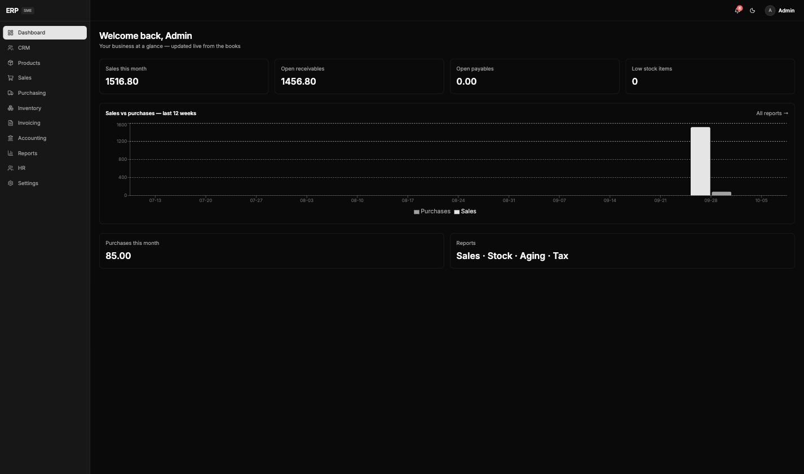

---

## Demo logins

Sign in at **[erp.aliahad.com](https://erp.aliahad.com)** with any account below.
Each role sees a different app — try two or three to see how permissions work.

| Role | Email | Password | What this person can do |
|---|---|---|---|
| **Administrator** | `admin@example.com` | `8abb04127570a863` | Everything, including users, roles and settings |
| Accountant | `accountant@example.com` | `dc920aa1846e` | Invoices, payments, journal, trial balance, reports |
| Sales | `sales@example.com` | `dc920aa1846e` | Customers, quotations, sales orders, customer invoices |
| Purchasing | `purchasing@example.com` | `dc920aa1846e` | Suppliers, purchase orders, goods receipts |
| Warehouse | `warehouse@example.com` | `dc920aa1846e` | Stock, receipts, deliveries, stock adjustments |
| HR | `hr@example.com` | `dc920aa1846e` | Employees, leave types, approve or reject leave |
| Viewer | `viewer@example.com` | `dc920aa1846e` | Read-only access across the whole system |
| Employee | `employee@example.com` | `dc920aa1846e` | Self-service: request and track their own leave |

> **This is a shared demo.** Other visitors use the same accounts, so data you
> see may change and may be reset at any time. Please don't enter real
> personal or company information.

---

## A 5-minute tour

Sign in as **Administrator** and follow the money from a sale to the books:

1. **Dashboard** — sales this month, open receivables and payables, low-stock
   alerts and a 12-week sales vs purchases chart, all live from the books.
2. **Sales → New sales order** — pick a customer and products; prices, discounts
   and tax are calculated as you type. **Save draft**, then **Confirm**.
3. **Inventory → Deliveries → New delivery** — choose the order and **Post** it.
   Stock goes down and the cost of goods sold is booked automatically.
4. **Invoicing → New invoice** — create it *from the order* (only what hasn't
   been invoiced yet is copied), then **Post**. It gets its official number.
5. **Invoicing → Payments → Record payment** — money in from the customer. The
   payment is matched to open invoices oldest-first; partial payments work too.
6. **Accounting → Journal entries** — every step above already created a
   balanced journal entry. **Trial balance** shows the books always balance.
7. **Reports** — sales by customer, purchases by supplier, stock valuation,
   aging and tax summary; export any of them to CSV.

Then sign out and sign in as **Sales** or **Viewer** to see the same company
through a narrower set of permissions.

---

## What's inside

| Area | Highlights |
|---|---|
| **CRM** | One list of customers and suppliers (a company can be both), payment terms, default currency, tags |
| **Products** | Goods and services, categories, units, tax rates, optional AI-drafted descriptions\* |
| **Sales** | Quotations that convert to orders, sales orders with partial delivery and partial invoicing |
| **Purchasing** | Purchase orders, goods receipts, supplier bills — bills can arrive before or after the goods |
| **Inventory** | Multiple warehouses, moving-average costing, deliveries, receipts, adjustments, low-stock alerts |
| **Invoicing** | Customer invoices, supplier bills, credit notes, refunds, payments, on-account payments, invoice email |
| **Accounting** | Automatic double-entry bookkeeping, chart of accounts, journal, ledger, trial balance, manual entries |
| **Multi-currency** | Invoice in any currency; exchange-rate gains and losses are booked automatically on payment |
| **Reports** | Dashboard, sales and purchase analysis, stock valuation, receivables/payables aging, tax summary, optional AI summary\* |
| **HR** | Employees, leave types and allowances, working-day leave requests, approve / reject, employee self-service |
| **Administration** | Users, roles and 84 fine-grained permissions, organization profile, numbering, currencies, full audit log |

\* AI features connect to an AI provider and are switched off in this public
demo; they show a "disabled" notice when clicked.

**Built to be trusted with money:** posted documents can't be edited, only
reversed; every amount is exact decimal arithmetic; each document and its
journal entry are saved together or not at all; every change is audit-logged.

---

## Screenshots

| | |
|---|---|
| 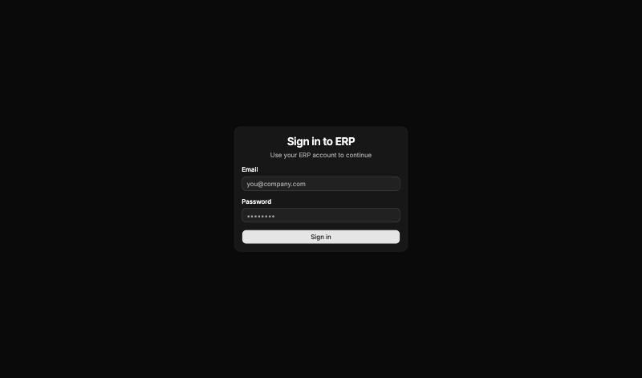 **Sign in** |  **Dashboard** |
| 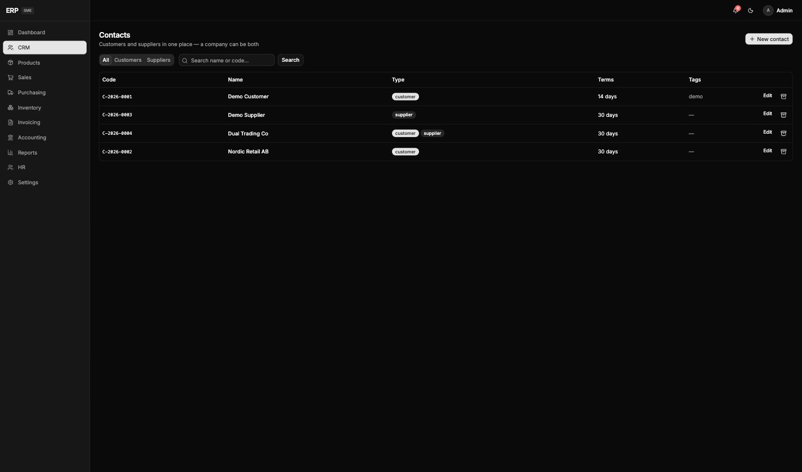 **CRM — customers & suppliers** | 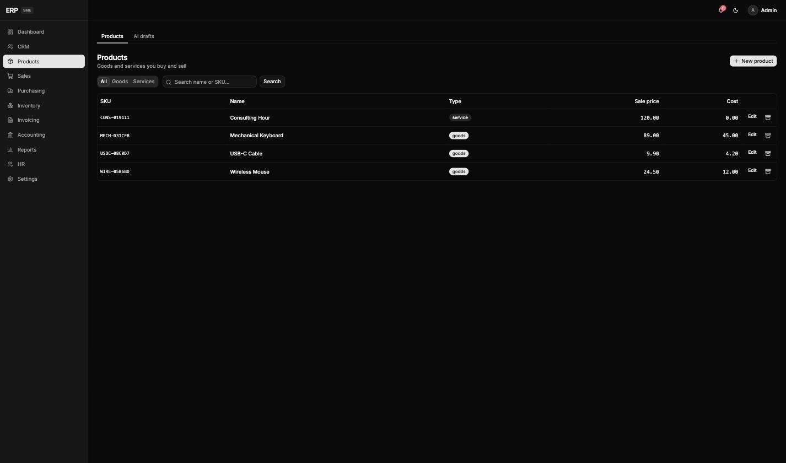 **Products & services** |
| 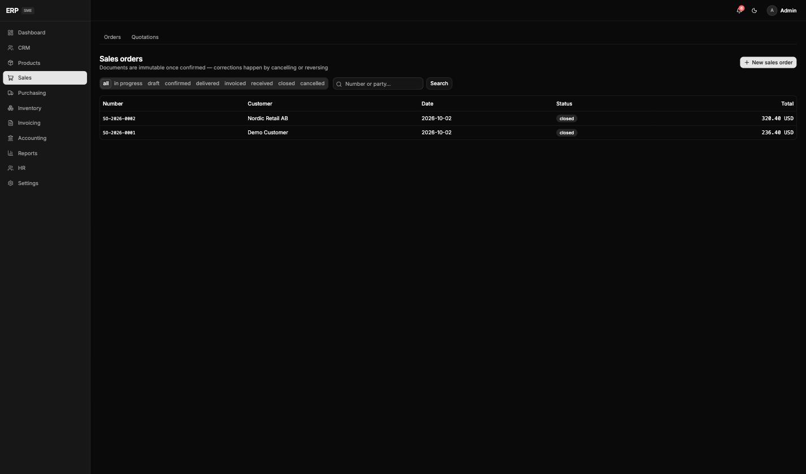 **Sales orders** | 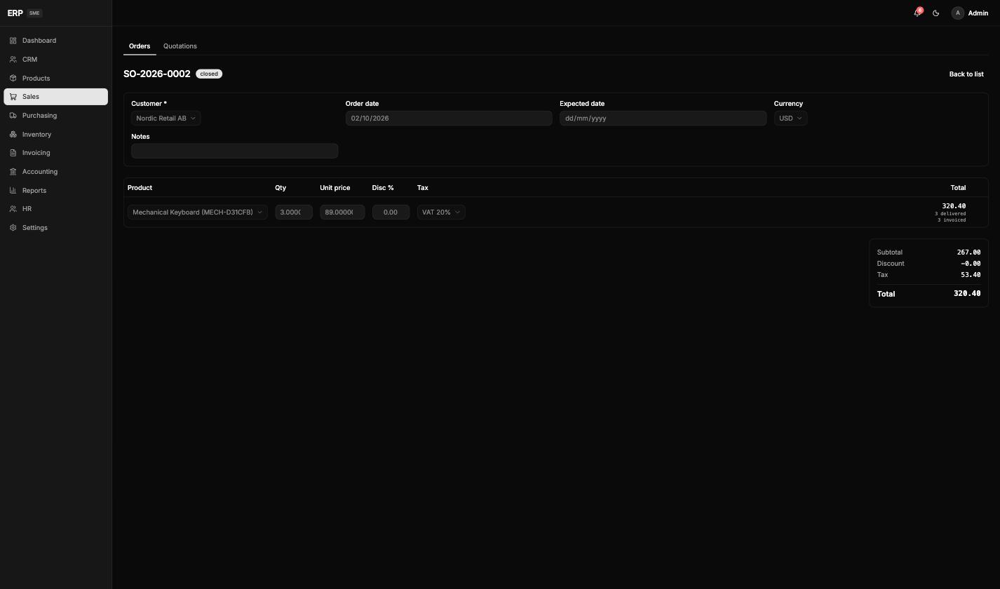 **Order with delivery & invoicing progress** |
| 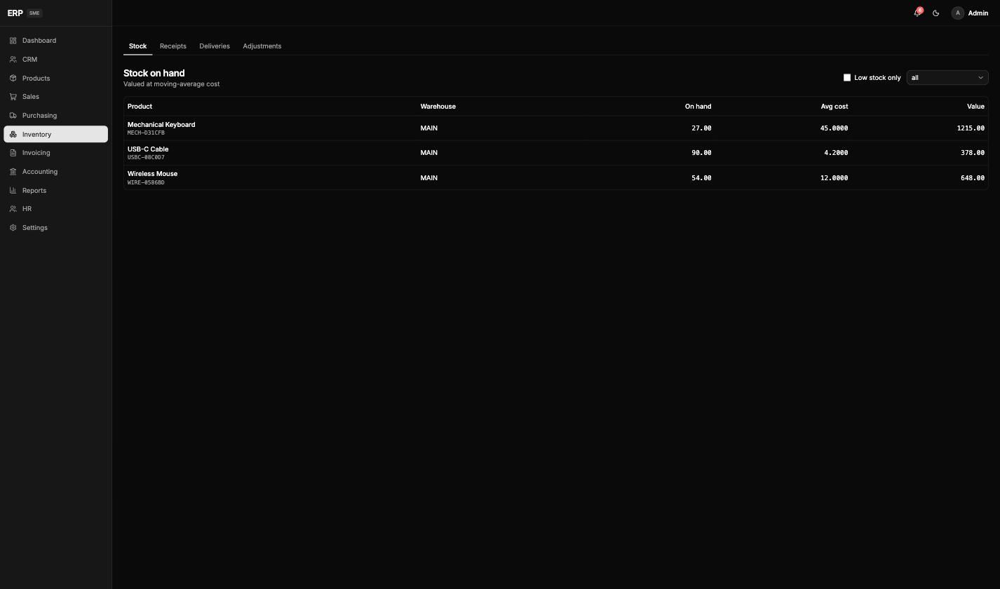 **Stock on hand, valued at average cost** | 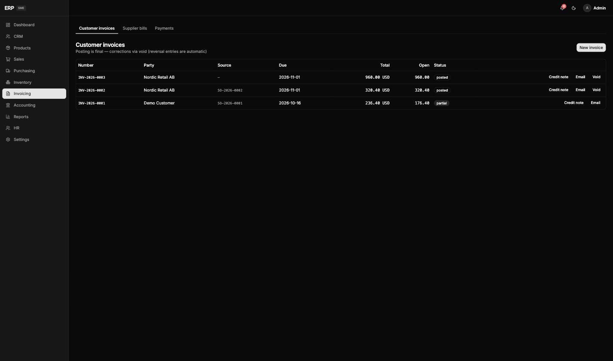 **Invoices with open balances, credit notes, email** |
|  **Automatic journal entries** | 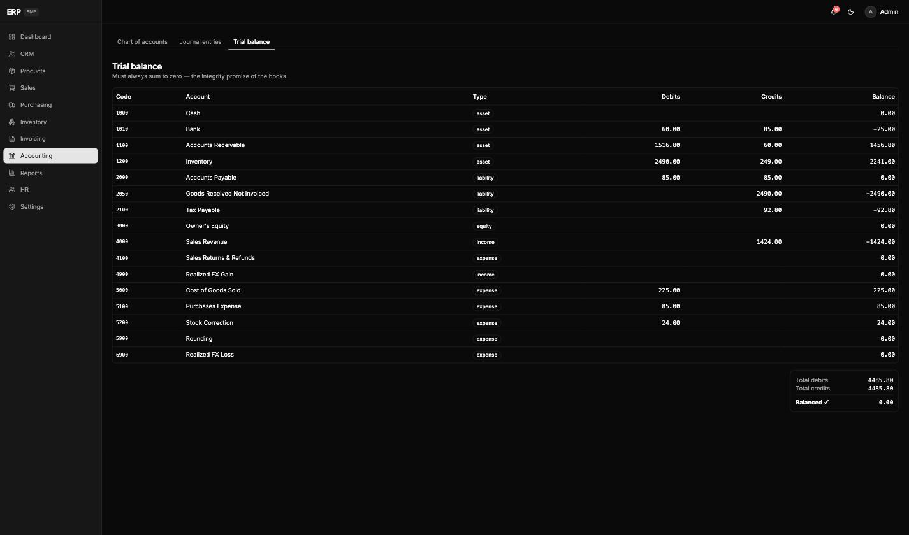 **Trial balance — always balanced** |
| 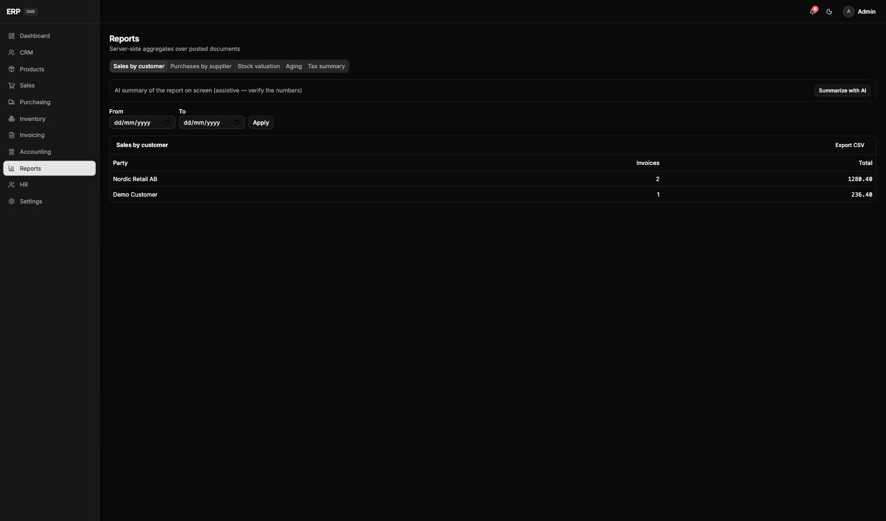 **Reports with CSV export** | 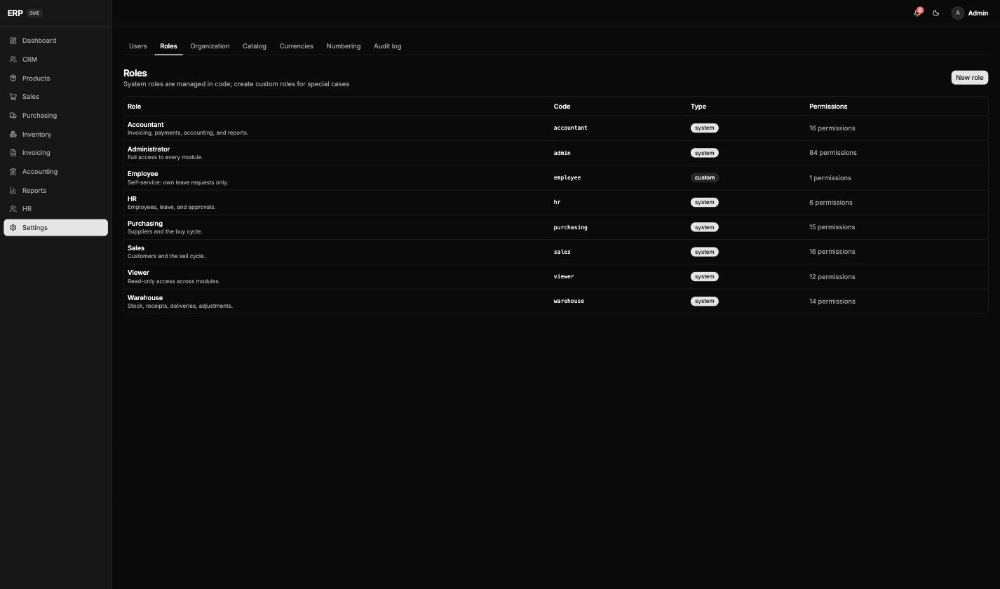 **Roles & permissions** |

---

## Technology

**Frontend:** React 19, TypeScript, Vite, TanStack Query, Tailwind CSS, shadcn/ui ·
**Backend:** Python 3.12, FastAPI, SQLAlchemy 2 (async), Alembic ·
**Data:** PostgreSQL 17, Redis 7, S3-compatible storage ·
**Operations:** Docker, background job worker, nightly backups, automated tests and CI,
automatic deployment on every push.

Developers: setup, architecture and deployment notes are in
[docs/DEVELOPMENT.md](docs/DEVELOPMENT.md).
